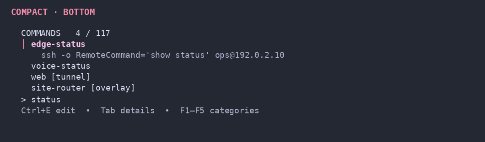
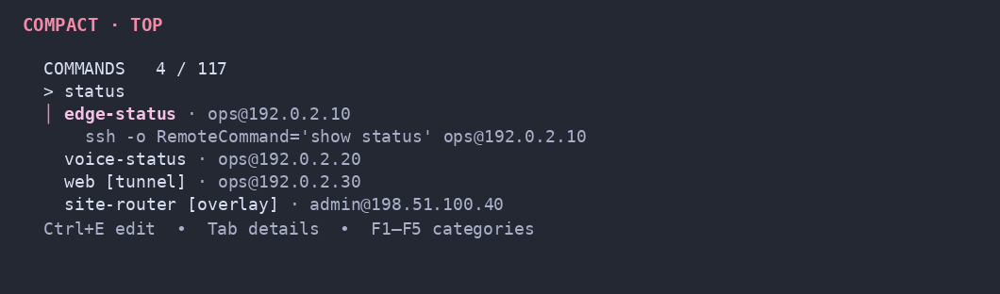
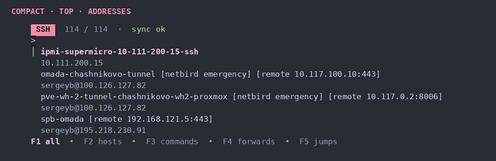
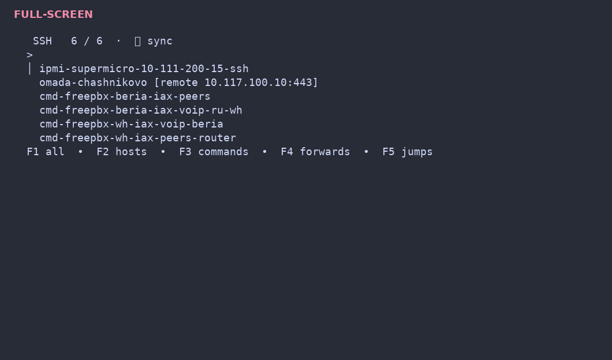

# f

`f` is a personal OpenSSH picker presented as a compact Bubble Tea application.

It reads normal OpenSSH config, fuzzy-searches every SSH entry type in one list, and runs real `ssh`. Imported SSH entries are not copied into a private host database.

## Interface

Both sizes use a flat interface without an outer frame or background container. In compact mode it stays near the left edge with a small margin, remains width-capped, and uses exactly as many rows as the current results need. The UI is built with Bubble Tea, Bubbles (`textinput`, `spinner`), and Lip Gloss:

- small colored active-category badge and counter;
- query line without a reverse-video block cursor, so transparent terminal backgrounds stay clean;
- match counter;
- single-line results by default, or an optional muted SSH address below each name;
- colored fuzzy-match characters;
- slim colored marker for the selected row;
- muted key-binding line without tabs or preview panes.

Choose the size:

```bash
f config ui compact      # compact picker in the current terminal
f config ui full-screen  # the same picker using the full screen
```

Place compact mode at either edge:

```bash
f config layout bottom
f config layout top
```

Show a muted `user@host:port` address below each entry name:

```bash
f config address on
f config address off     # return to single-line results
```

Legacy config values migrate automatically: `light` → `compact`, `full` → `full-screen`.

### Compact, bottom



### Compact, top



### Compact, top with address rows



### Full-screen



## Install on a new machine

```bash
curl -fsSL https://raw.githubusercontent.com/sergeybychkovvvpgroup-beep/f/main/install.sh | sh
f setup <ssh-config-repo-url>
```

The installer adds the `f` binary. `f setup` clones the hosts repository into `~/.ssh/config.d/f_hosts` and ensures `~/.ssh/config` includes `~/.ssh/config.d/f_hosts/*.conf`.

The built-in update checker uses the public GitHub repository by default. Override it temporarily with `F_UPGRADE_REPO` when needed.

To publish the current machine's existing hosts as the initial repository contents:

```bash
f setup --adopt <ssh-config-repo-url>
```

## Quick start

```bash
f                       # open picker
f prod db               # start with a query
f list                  # print known entries
f config show           # show config paths
f config sync           # pull host changes
f config ui compact     # compact UI
f config ui full-screen # full-screen UI
f config layout bottom  # compact at bottom
f config layout top     # compact at top
f config address on     # node address below the name
```

Keys:

- type to filter;
- `↑` / `↓`, `Ctrl+K` / `Ctrl+J` to move through results in visual top-to-bottom order in every layout;
- `Enter` to run the selected SSH command;
- `Ctrl+Y` / `Alt+Enter` to print without running;
- `Ctrl+E` / `Alt+E` to edit the selected SSH config block;
- `Ctrl+N` to add a host;
- `Esc` / `Ctrl+C` to quit.

## Unified search

An ordinary query searches SSH logins, jump routes, port forwards, and `RemoteCommand` entries together; no prefix is required.

Category bindings filter without clearing the query: `F1` all, `F2` hosts, `F3` commands, `F4` forwards, and `F5` jumps. A muted one-line legend is shown in the status bar.

## SSH config model

The expected active file is:

```text
~/.ssh/config.d/f_hosts/f.conf
```

`~/.ssh/config` should include:

```ssh-config
Include ~/.ssh/config.d/f_hosts/*.conf
```

Imported entries execute through the exact alias:

```bash
ssh alias-name
```

This preserves OpenSSH behavior for `ProxyJump`, forwards, `RemoteCommand`, identity files, legacy algorithms, and other options.

## Editing and sync

`Ctrl+E` exits the TUI and opens `$EDITOR` (`nano` fallback). The saved block is upserted into `~/.ssh/config.d/f_hosts/f.conf` between `# f-edit begin/end` markers.

When `~/.ssh/config.d/f_hosts` is a Git repository, `f` pulls on startup and commits/pushes after edits or `f add`.

## Display conventions

- obsolete noisy prefixes on imported aliases are hidden only in display names;
- route suffixes become labels such as `[netbird emergency]`, `[jump]`, and `[tunnel]`;
- forwards include their remote endpoint;
- real aliases and commands remain unchanged.

## Adding entries

```bash
f add NAME HOST
f add db 10.20.30.40 -user admin -p 2222 --args "-A -J jump"
```

`Ctrl+N` starts interactive creation. New entries are stored as OpenSSH blocks in `~/.ssh/config.d/f_hosts/f.conf`.

## Build from source

```bash
go test ./...
go build -o ~/.local/bin/f ./cmd/f
```

Production builds should embed the exact commit:

```bash
commit=$(git rev-parse HEAD)
go build -buildvcs=false -ldflags "-X f/internal/app.buildCommit=$commit" -o ~/.local/bin/f ./cmd/f
```
